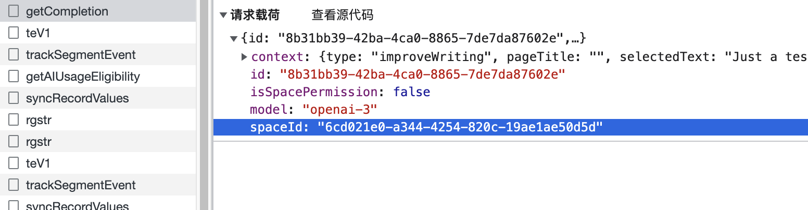
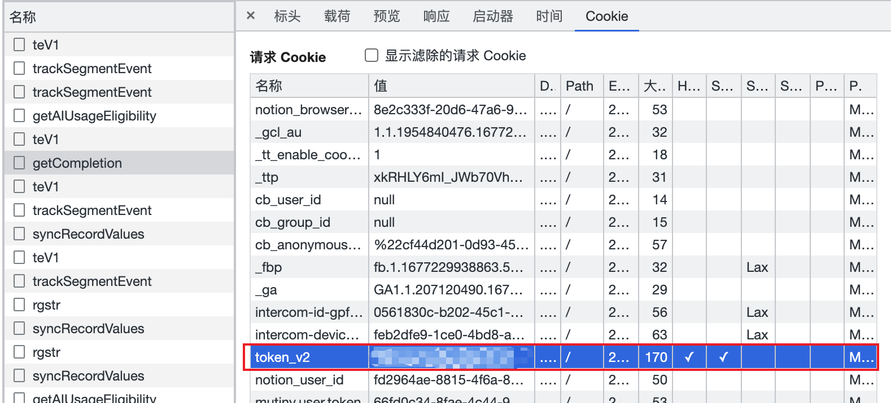

# NotionAI-go
NotionAI-go is an unofficial NotionAI API that provides a Go SDK, inspired by https://github.com/Vaayne/NotionAI.

## NotionAI Go SDK
The NotionAI Go SDK is a wrapper for the All NotionAI APIs, you can use it to simplify integration of NotionAI solutions into your projects.

### Usage

#### Installing
Use `go get` to retrieve the SDK to add it to your GOPATH workspace, or project's Go module dependencies.
```
go get github.com/jyz0309/notionAI-go
```

#### Get Notion Token and Workspace ID
To use the NotionAI Go SDK, you need to obtain a Notion token. You can do this by following these steps:

1. Open your browser DevTools
2. Find the spaceId of your Notion workspace in the request body.
3. Find the request cookies and copy the value for token_v2





#### Init the client
First, you need to use the `token` and `spaceID` to init notion AI client, just like this:
```go
import "github.com/jyz0309/notionAI-go/client"

func main(){
	cli := client.NewClient("Your notion token", "Your notion space ID")
    //...
}
```
After init the client, you can use client to call notion AI API in pkg.


#### API Introduction
All NotionAI APIs are supported. You can check the `client` package to see all APIs.

1. WriteWithTopic
```go
/*
Usage: WriteWithTopic writes for special topic, like Blog, Essay, Todo list
Args:
    topic(TopicType): the special topic
    prompt(string): prompt for writing
*/
// Example:
func main(){
	cli := client.NewClient("Your notion token", "Your notion space ID")
    cli.WriteWithTopic(common.BlogPost, "Golang")
}
```

2. WriteWithPrompt
```go
/*
Usage: WriteWithPrompt writes with special prompt, like summarize, explain_this, improve_writing
Args:
    promptType(PromptType): the special prompt
    content(string): the content for your writing
*/
// Example:
func main() {
	cli := client.NewClient("Your notion token", "Your notion space ID")
	cli.WriteWithPrompt(common.MakeLonger, "Today is friday!")
}
```

3. Translate
```go
/*
Usage: Translate will translate the content to given language
Args:
    lang(SupportedLanguage): the target language
    prompt(string): content to translate
*/
// Example:
func main() {
	cli := client.NewClient("Your notion token", "Your notion space ID")
	cli.Translate(common.Chinese, "Today is friday!")
}
```

5. ChangeTone
```go
/*
Usage: ChangeTone uses specific tones to optimize content.
Args:
    tone(SupportedTone): the target tone
    prompt(string): content to change
*/
// Example:
func main() {
	cli := client.NewClient("Your notion token", "Your notion space ID")
	cli.ChangeTone(common.Professional, "Today is friday!")
}
```


6. ContinueWriting
```go
/*
Usage: ContinueWriting can generate the following content based on the given input content.
Args:
    content(string): content to continue writing
*/
// Example:
func main() {
	cli := client.NewClient("Your notion token", "Your notion space ID")
	cli.ContinueWriting("Today is friday!")
}
```

7. HelpMeDraft
```go
/*
Usage: HelpMeDraft can generate a draft based on the given prompt.
Args:
    prompt(string): prompt used to generate a draft
*/
// Example:
func main() {
	cli := client.NewClient("Your notion token", "Your notion space ID")
	cli.HelpMeDraft("How the nation AI work?")
}
```

8. HelpMeEdit
```go
/*
Usage: HelpMeEdit can optimize content based on the given prompt.
Args:
    content(string): content you need to optimize
    prompt(string): prompt used to generate a draft
*/
// Example:
func main() {
	cli := client.NewClient("Your notion token", "Your notion space ID")
	cli.HelpMeEdit("The content is about how the nation AI work", "please help me make it longer.")
}
```

### Example

```go

func main() {
	cli := client.NewClient("Your notion token", "Your notion space ID")
	resp, err := cli.ContinueWriting("Deploy a mysql service")
	if err != nil {
		log.Default().Panic(err)
		return
	}
	/* resp:
    To deploy a mysql service, you can use a containerization tool such as Docker or Kubernetes. 
    First, you'll need to create a Dockerfile or Kubernetes deployment file that includes the mysql image and any necessary environment variables or configuration options. 
    You can then use the appropriate tool to build and deploy the container, making sure to expose the necessary ports and configure any required network settings.
    */
}

```